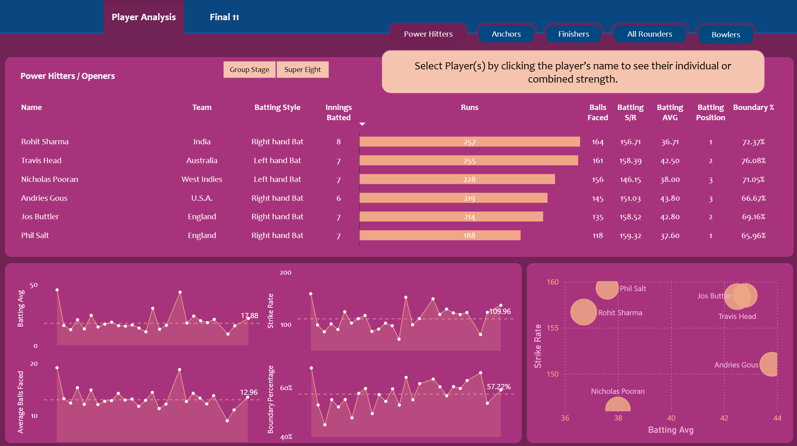
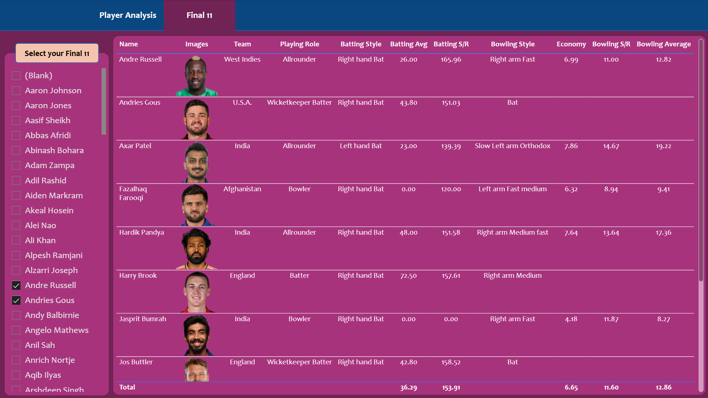
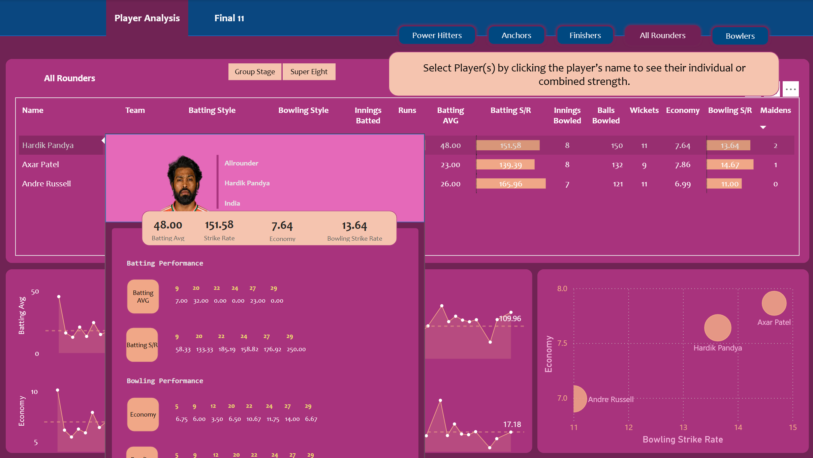

# 🏏 T20 World Cup Analytics

### 📌 Project Overview

This project analyzes T20 World Cup cricket data to uncover key insights about teams and players.
The pipeline includes web scraping, data cleaning, transformation, modeling, and dashboarding.
Finally, I used the analysis to select the best playing XI based on performance.

## 🔍 Workflow
**1. Data Extraction**
  - Scraped match & player data from ESPN Cricinfo using Bright Data.
  - Stored results in structured JSON files.

**2. Data Cleaning and Transformation**
  - Processed JSON files using Pandas (Python).
  - Performed additional transformations in Power Query.

**3. Data Modeling and Analysis**
  - Built relationships and measures in Power BI.
  - Used DAX to create parameters, KPIs, and calculated metrics.

**4. Dashboard and Insights**
  - Designed an interactive Power BI dashboard with visuals for teams and players.
  - Extracted insights to finalize the best XI players for the tournament.

## 🛠️ Tech Stack
- **Web Scraping:** Bright Data
- **Data Processing:** Python (Pandas), Power Query
- **Modeling & KPIs:** DAX in Power BI
- **Visualization:** Power BI Dashboard

## 📸 Dashboard Preview

## 📊 Key Insights
- Identified top-performing players.
- Compared team strengths & weaknesses.
- Built parameters for dynamic what-if analysis.
- Selected the final playing XI based on data-driven insights.
